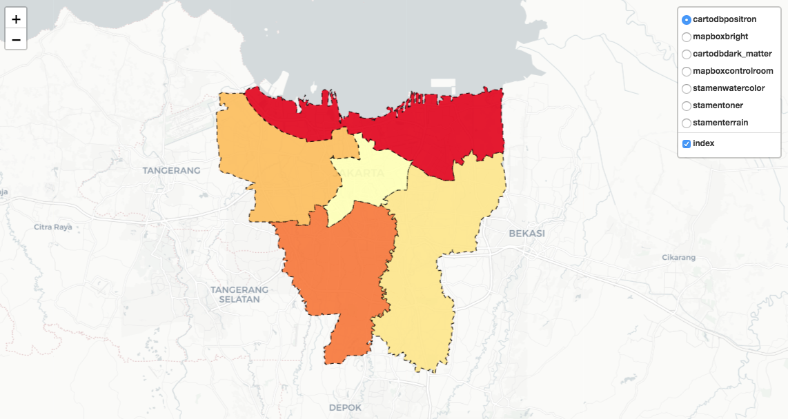
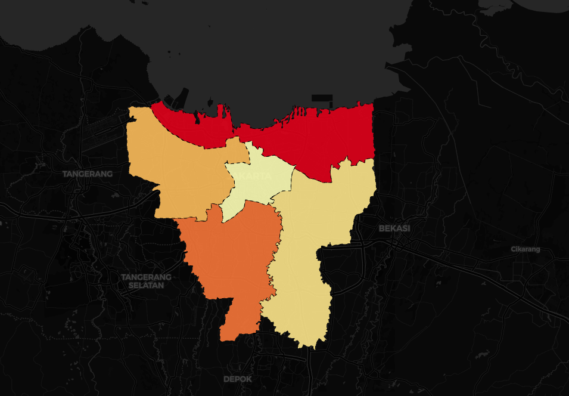
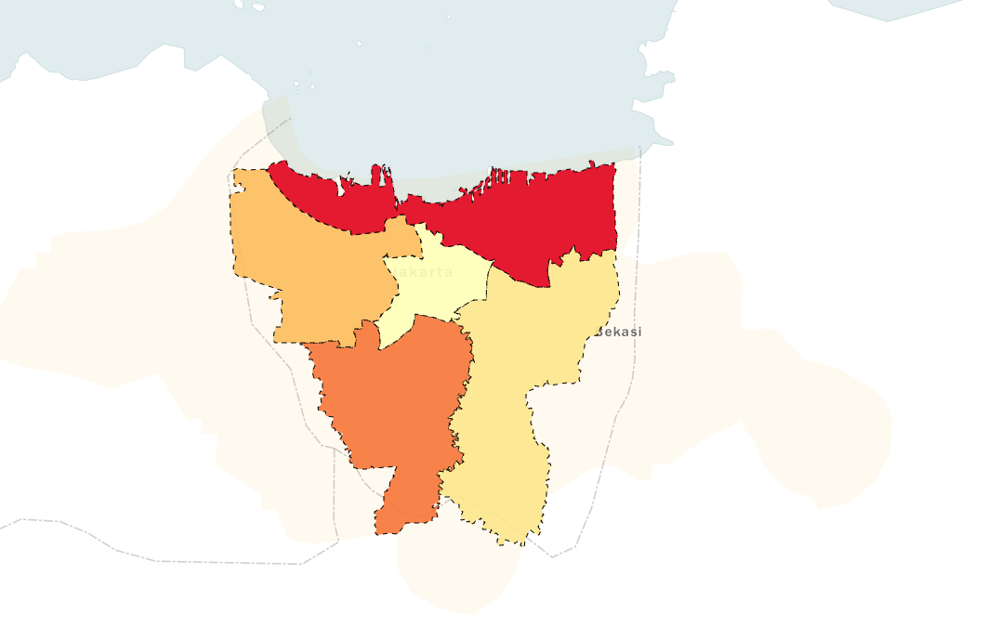
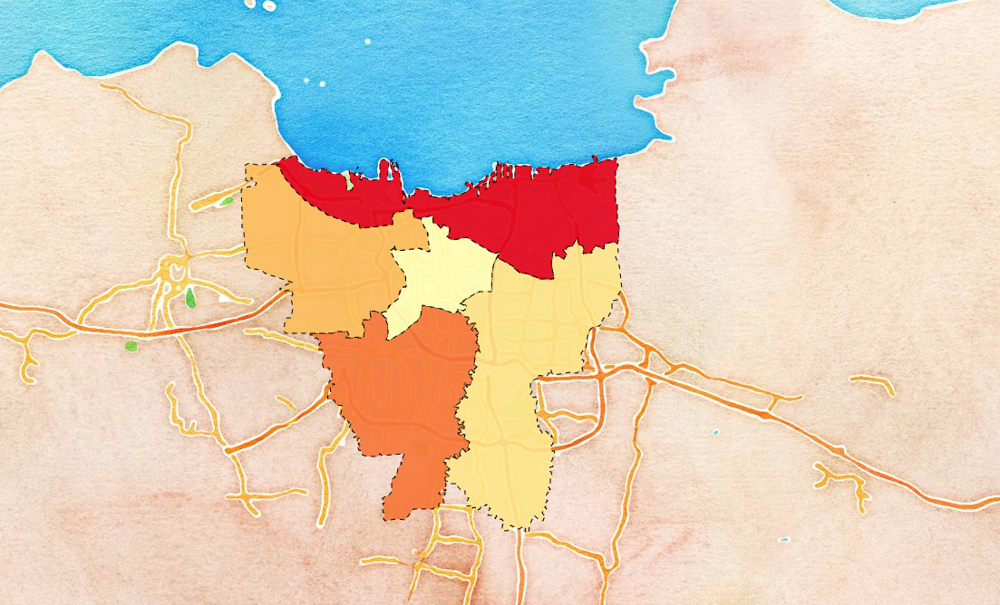
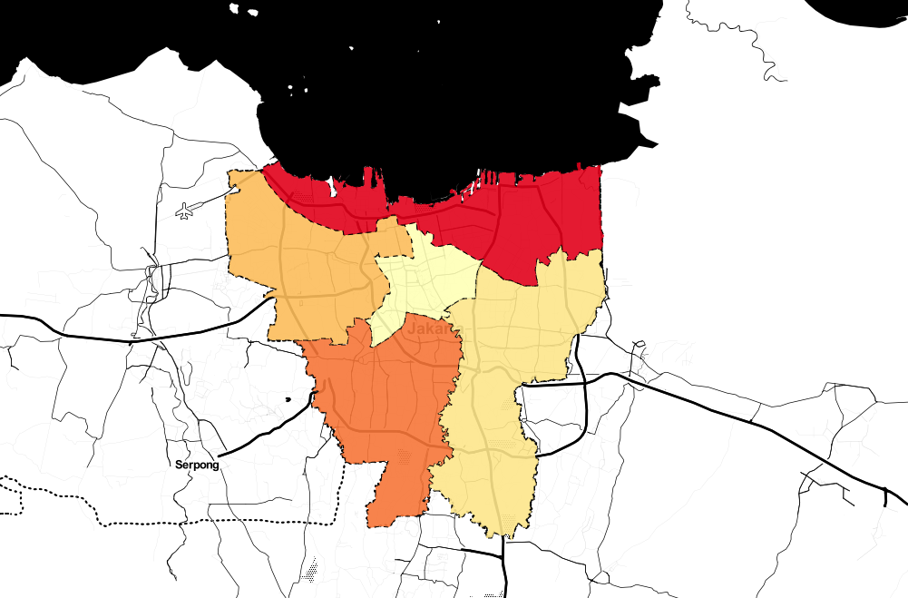
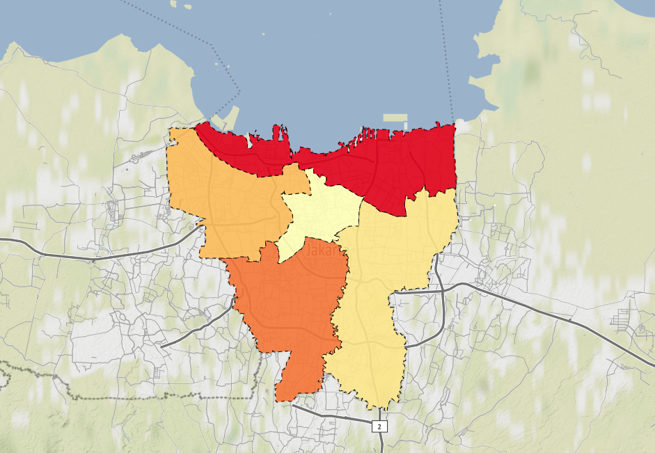

# folium-maps-jakarta
This project contain the implementation of folium maps using choroplath & geojson method.



## Prerequisite

* Jupyter Notebook


## Features 

### Geojson Generator
Generate Geojson format using generate_coordinate.ipynb

1. search region https://nominatim.openstreetmap.org
2. on details copy the OSM ID (e.g 5802438)
3. paste OSM_ID into ID_*.csv
4. then run the generate_coordinate
5. it should be generate json file (e.g JK_regencies.json)

### Multiple Tiles

|   |   |   |   |
|---|---|---|---|
| cartodbpositron | cartodbdark_matter  |  Mapbox Bright  | Mapbox Control Room  |
|  stamenwatercolor  |  Stamen Toner |  Stamen Terrain |   |


### Maps - Choroplath

``` python
m = folium.Map(location=[-6.2, 106.90],tiles='OpenStreetMap', zoom_start=11)
folium.Choropleth(
    geo_data=regency_geo,
    name='choropleth',
    data=regency_data,
    columns=['Regency', 'Index'],
    key_on='feature.id',
    fill_color='YlOrRd',
    fill_opacity=1.0,
    line_opacity=0.2,
    legend_name='Index'
).add_to(m)
```

### Maps -Geojson

``` python
folium.GeoJson(
    regency_geo,
    name='index',
    style_function=lambda feature: {
        'fillColor': colormap(index_dict[feature['id']]),
        'color': 'black',
        'weight': 1,
        'dashArray': '5, 5',
        'fillOpacity': 0.9,
    }
).add_to(m)
```


## Thanks to
* [folium](https://github.com/python-visualization/folium) - To build awesome maps library
* [Wilayah-Administratif-Indonesia](https://github.com/edwardsamuel/Wilayah-Administratif-Indonesia) - Where data of Provinces, Regencies, & Districts comes from
s